# days

如果发现在clone代码时特别慢，推荐使用：https://gitclone.com/ 缓存加速
## v1.0
实现了分布式事务管理功能

使用的核心框架：

springboot2.3.3 +nacos-1.3.2 +dubbo-2.7.8 +druid-1.1.22 +seata1.4.0 +mybatis-plus-3.4.0

此工程v1.0的博文： 

springboot集成dubbo2.7.8+nacos1.3.2+seata1.4.0 分布式事务解决demo

https://blog.csdn.net/qq_38046739/article/details/109951935

## v2.0

增加了springcloud gateway网关

根据spring的官网：
https://docs.spring.io/spring-cloud/docs/Hoxton.SR8/reference/html/

选出了适合springboot2.3.3的springcloud版本：

springcloud版本：Hoxton.SR8

此工程v2.0的博文：

springboot-2.3.3+dubbo-2.7.8+nacos-1.3.2+gateway-Hoxton.SR8

https://blog.csdn.net/qq_38046739/article/details/113921103


## v3.0

### 版本升级

1. 升级jdk版本为 17
2. 升级spring-cloud-alibaba 的版本为 2023.0.3.2
3. 升级spring-cloud 的版本为 2023.0.4
4. 升级springboot版本为 3.2.12 
5. 升级dubbo版本为 3.3.2
6. 升级mybatis-plus版本为springboot3专用版本  3.5.9
7. 升级seata版本为 2.0.0

各个版本如何确定的网址链接 [总的pom文件](pom.xml) 中有说明.

### 各个框架的版本确定流程:

第一步. 确定 spring-cloud-alibaba 可以支持的spring-cloud 版本

第二步. 根据 spring-cloud 版本确定springboot版本

第三步. 根据 springboot版本确定其他框架的版本


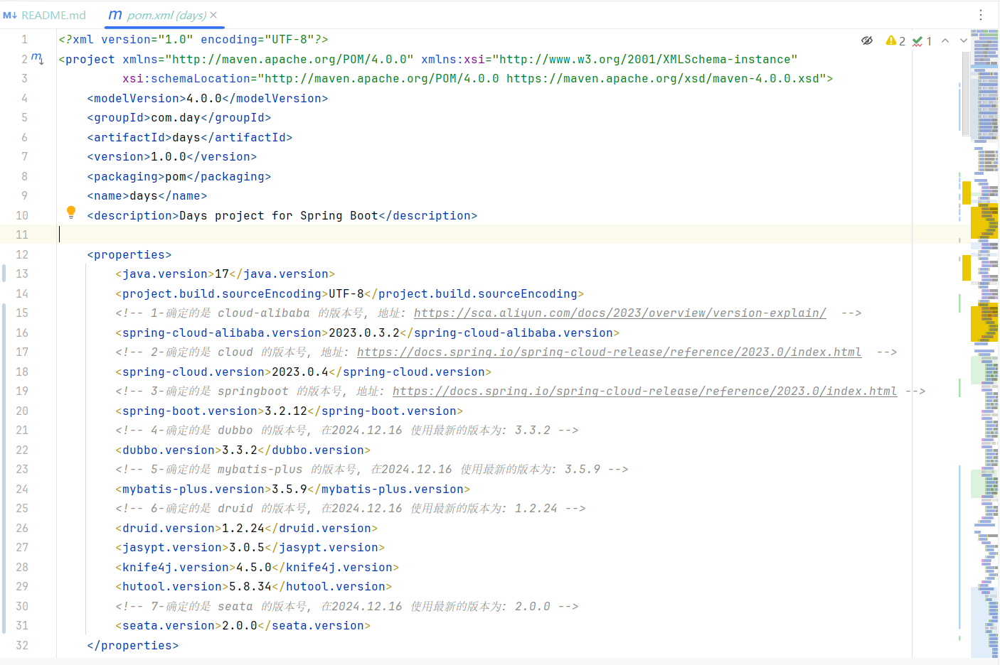

### 依赖的导入说明

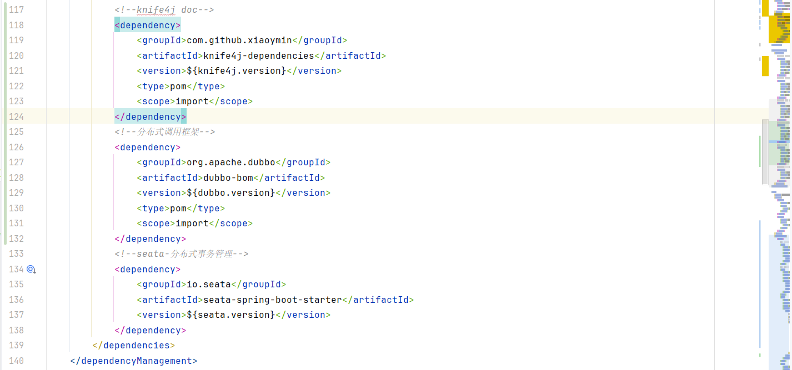

### 接口文档使用 knife4j-4.5.0

更新接口文档为 knife4j 最新版本: 4.5.0

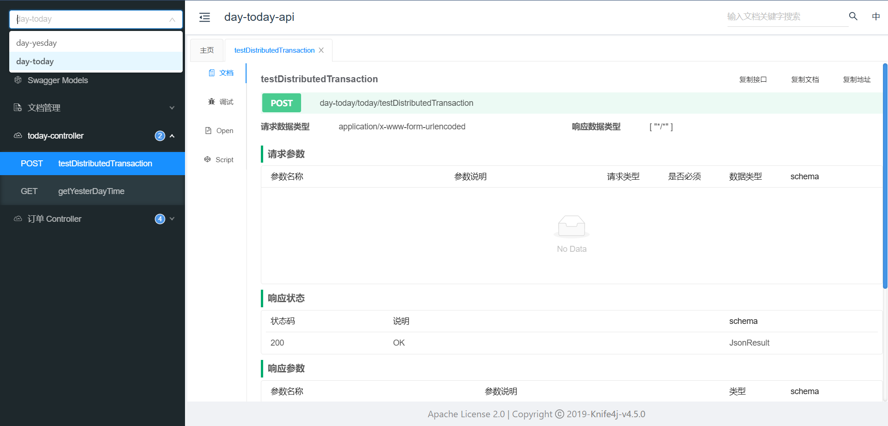

### nacos + seata 的版本升级

> nacos: 2.4.3
> 下载地址: https://github.com/alibaba/nacos/releases

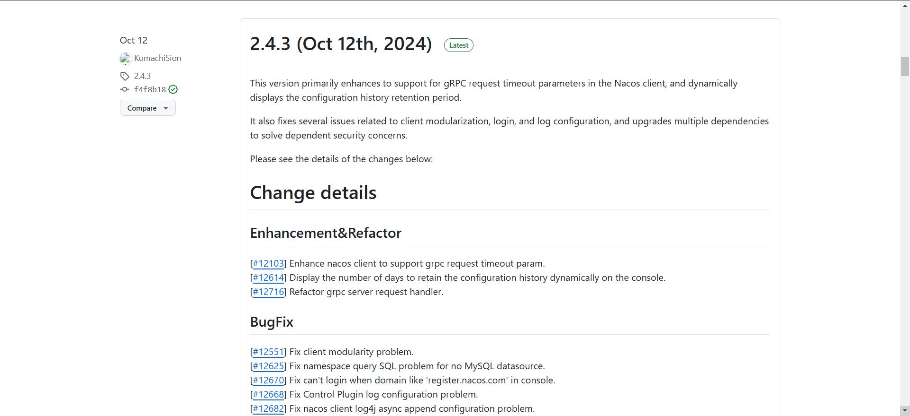

> seata: 2.2.0
> 下载地址: https://seata.apache.org/download/seata-server

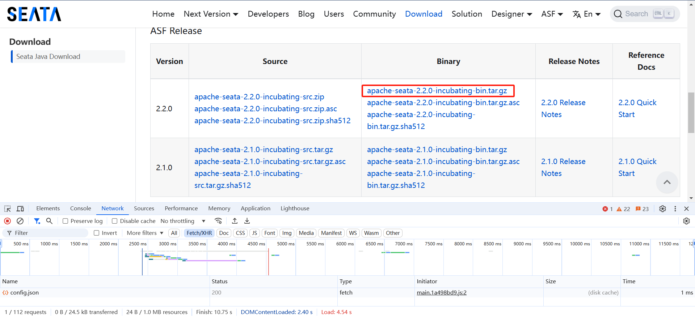

### v4版本的初始化sql

参考: [db_v3](db_v4) 文件夹

[days_v3_all.sql](db_v4/days_v3_all.sql) 文件


### 博客地址:


### nacos-2.4.3 服务注册列表

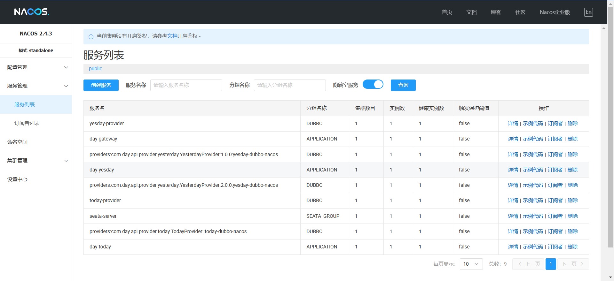
### nacos-2.4.3 服务配置列表

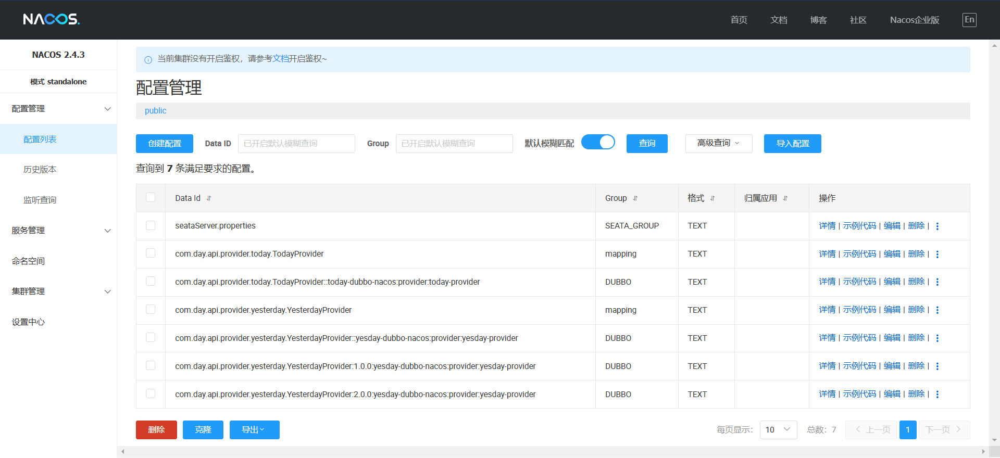

### seata-2.2.0 管理页面

工程中使用的配置文件: [seata-2.2.0的配置文件](db_v4/application.yml)

nacos配置中心的关键修改: 

```
#Transaction routing rules configuration, only for the client
service.vgroupMapping.day_today_tx_group=seata-days
#If you use a registry, you can ignore it
service.seata-days.grouplist=127.0.0.1:8091
service.disableGlobalTransaction=false
```

登录配置文件中配置的账号和密码: admin/admin

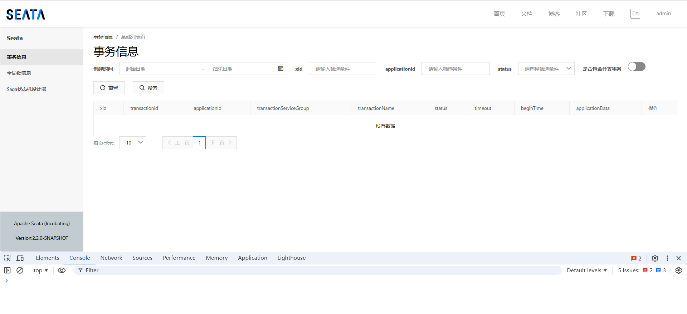

## 分布式事务测试接口

### 请求接口

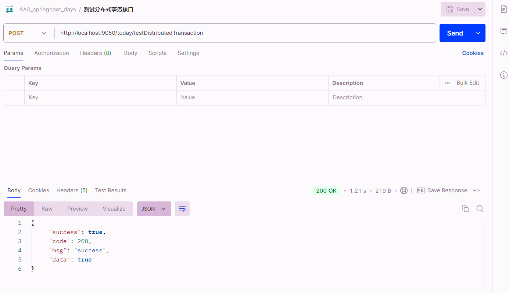

### 事务提交

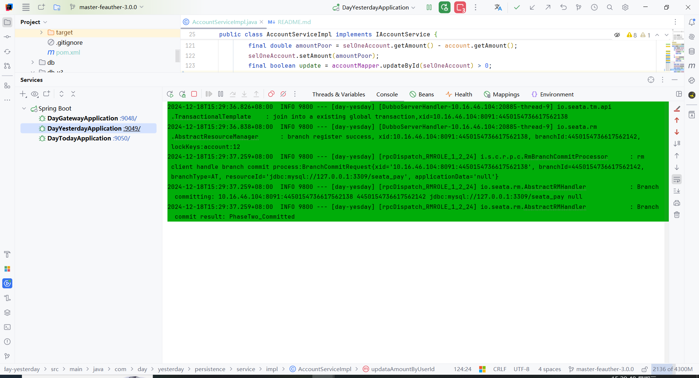

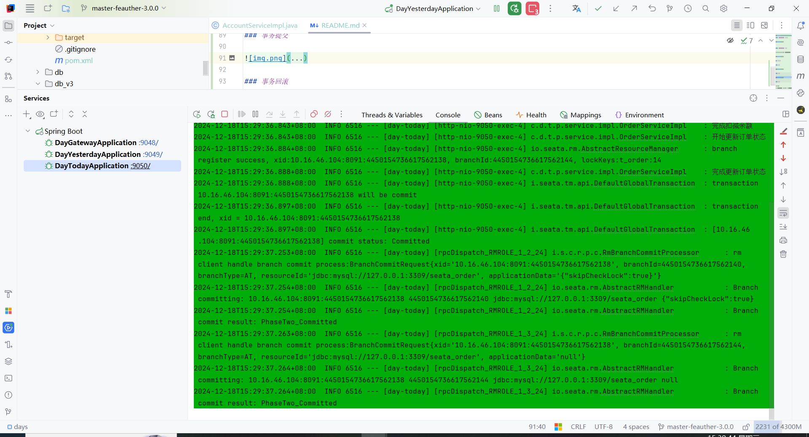

## 分布式事务回滚

#### 测试分布式事务回滚的过程:
#### 请求 day-today 项目中的接口, 调用 day-yesday 项目中版本号为2.0.0的dubbo接口, 在 day-yesday 项目中抛出 " / by zero" 异常 得到事务是否回滚

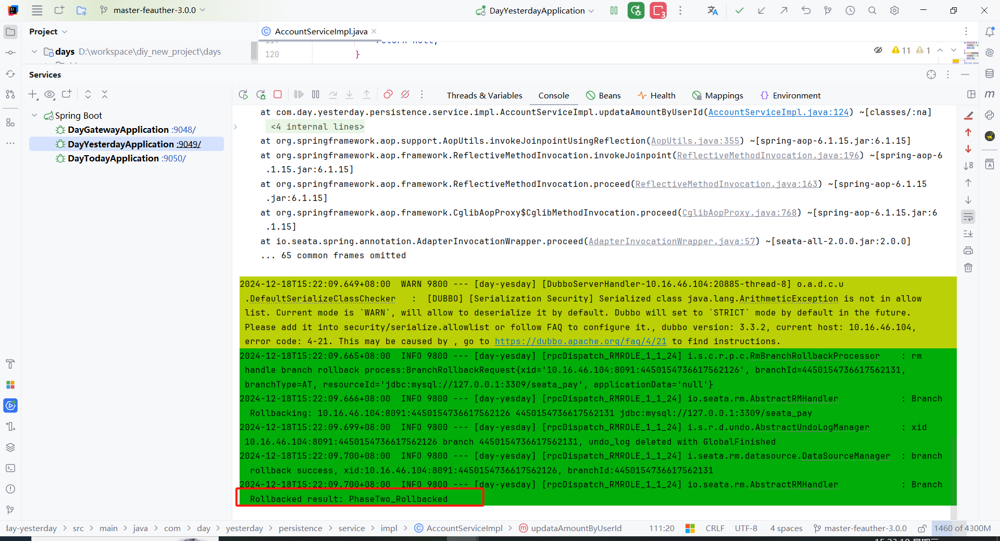

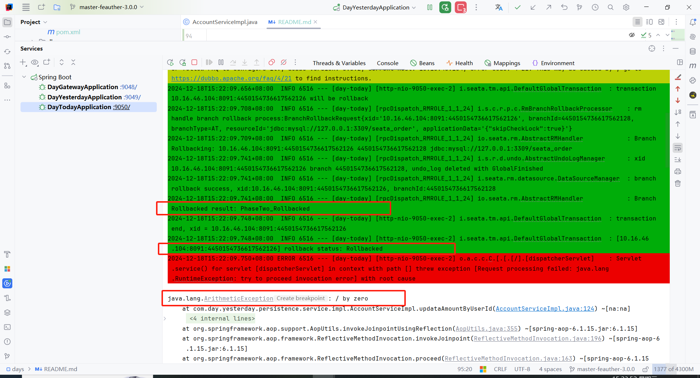

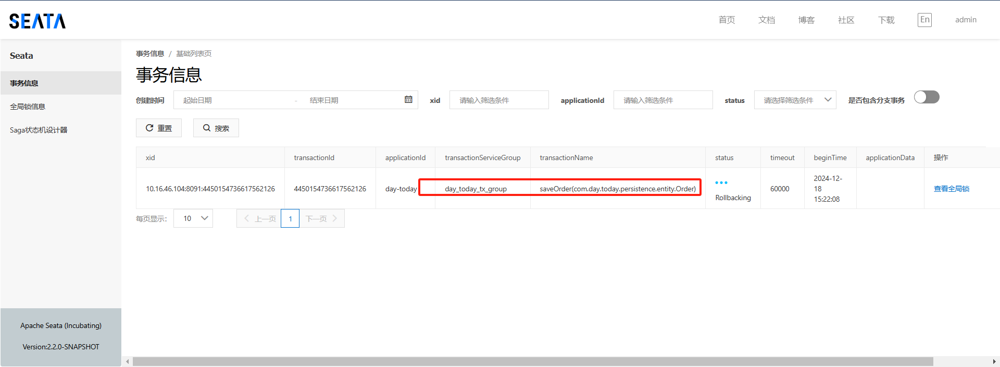

## 其中配置文件中的关键信息

### seata_server端的配置信息与nacos配置中心的信息

> 说明: 此处nacos中dataId为:"seataServer.properties"配置文件信息来源于 ...\seata-2.2.0\seata-server\script\config-center\config.txt 文件的全文, 仅需要修改为其中关键属性即可.

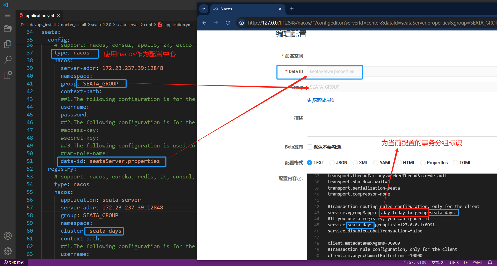

### seata_client端的配置信息与nacos配置中心的信息(即springboot应用)

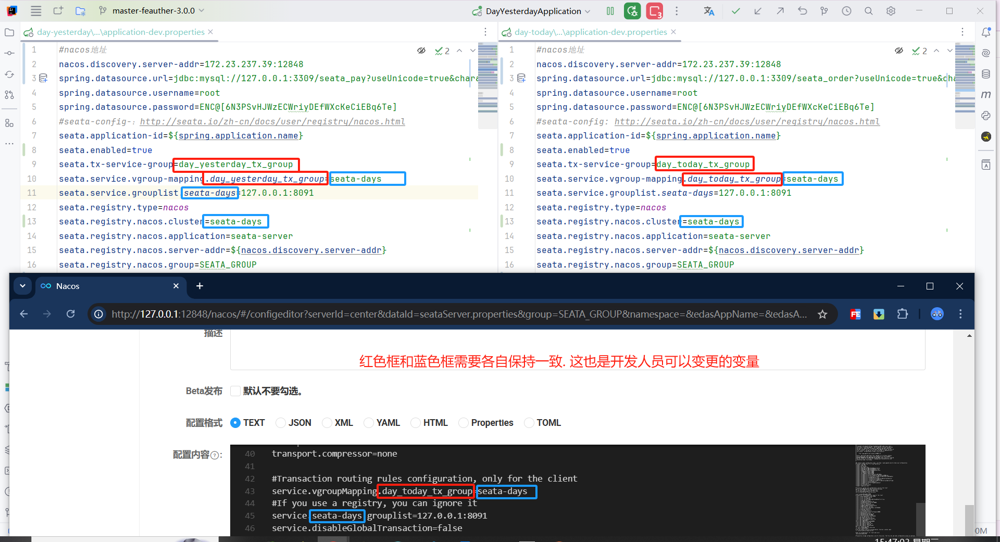


# 遇到的问题


## 1. dubbo中配置需要改变的地方

> dubbo-3.3.2 中对序列化的类做了白名单和黑名单的限制

需要在配置文件中增加可以暂时取出报错问题

> dubbo.application.serialize-check-status=WARN

即此处除黑名单以外的配置类都可进行序列化

具体参考nacos官网

提出的问题: https://github.com/apache/dubbo/issues/14193

类检查机制: https://cn.dubbo.apache.org/zh-cn/overview/mannual/java-sdk/tasks/security/class-check/ 

## 2. nacos中配置需要改变的地方

> spring.cloud.nacos.config.import-check.enabled=false

## 3. seata中配置需要改变的地方

1. 需要指定 nacos 集群名称

> seata.registry.nacos.cluster=seata-days

2. 进行控制是否启用seata事务管理器

> seata.enabled=true


